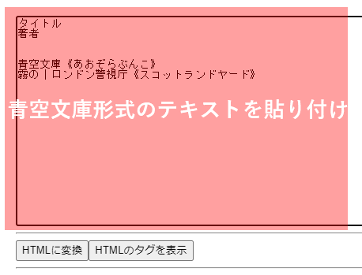

# AozoraJavaScriptParser

青空文庫形式のテキストをJavaScriptでhtmlに変換します。

## 動作環境

JavaScriptが動作するブラウザ

## インストール

ダウンロードして、index.htmlをブラウザで開くだけで動作します。

```
git https://github.com/gearsns/AozoraJavaScriptParser.git
```

## 実行

[https://gearsns.github.io/AozoraJavaScriptParser/](https://gearsns.github.io/AozoraJavaScriptParser/)

又は

ダウンロードしたindex.htmlを開きます。



1. テキストボックスに、青空文庫形式のテキストを貼り付けます。

2. 「HTMLに変換」ボタン押下で、下に変換結果が表示されます。

3. 変換したHTMLは、「HTMLのタグを表示」ボタンの押下で確認できます。

